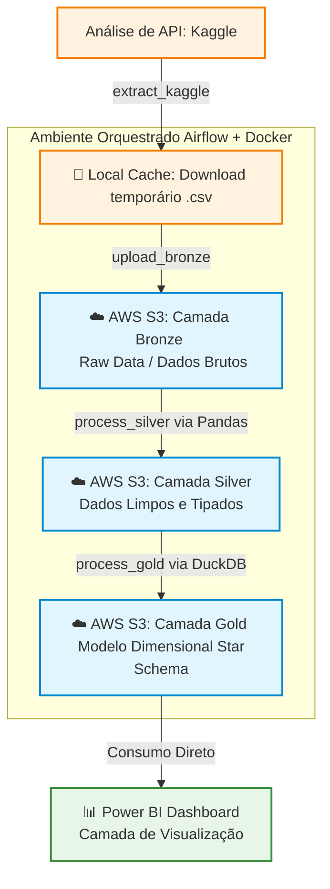

# 📊 End-to-End Data Pipeline: Credit Score Classification
### Projeto Final — Bootcamp Data Girls (Trilha de Engenharia de Dados)

Este repositório apresenta o projeto prático final desenvolvido para a conclusão do Bootcamp **Data Girls** na trilha de **Engenharia de Dados**. O objetivo principal foi construir um pipeline robusto, automatizado e orquestrado para a extração, tratamento, modelagem e visualização de dados de concessão de crédito. 

O projeto adota a **Arquitetura Medalhão (Bronze, Silver e Gold)** com persistência em nuvem e utiliza o **Apache Airflow** rodando em **Docker** como orquestrador central.

---

## 🏗️ Arquitetura do Projeto & Fluxo de Dados

O ecossistema foi projetado pensando em escalabilidade, governança e idempotência. Cada camada cumpre um papel estratégico no ciclo de vida do dado, sendo armazenada de forma centralizada em buckets da **AWS S3**.



## 🛠️ Tecnologias e Ferramentas Utilizadas

* **Orquestração:** Apache Airflow (Versão 2.x)
* **Conteinerização:** Docker & Docker Compose
* **Cloud Storage:** AWS S3 (Persistência global de todas as camadas)
* **Manipulação & Limpeza:** Pandas
* **Engine de Modelagem & OLAP:** DuckDB
* **Consumo de API:** `kagglehub`
* **Visualização de Dados:** Power BI Desktop (`.pbix`)
* **Ambiente de Desenvolvimento:** Windows com WSL2 (Ubuntu)

---

## 🧹 Camada Silver: Transformações e Limpeza de Dados

A estruturação da camada Silver foi baseada em uma Análise Exploratória (EDA) que identificou a natureza transacional mensal do dataset. Utilizando **Pandas** e **AWS Wrangler**, os dados brutos foram limpos e padronizados seguindo boas práticas de Engenharia de Dados:

* **Alinhamento de Schema & Unificação:** Engenharia de schema para unificar as bases de treino e teste do S3 via concatenação vertical, tratando a ausência da variável alvo na base de teste.
* **Unicidade Transacional:** Eliminação de registros duplicados utilizando a chave composta `['Customer_ID', 'Month']`.
* **Imputação Avançada (`Groupby + Transform`):** Preenchimento dinâmico de dados cadastrais e financeiros omitidos (`Name`, `Annual_Income`, `Occupation`, `Type_of_Loan` e `Age`) propagando o histórico do próprio cliente.
* **Sanitização & Regras de Negócio:** * Placeholder corrompidos (como `'_______'`) e valores inconsistentes (contas bancárias negativas) foram convertidos em `NaN`.
  * Ausências de investimentos e pagamentos em atraso foram padronizadas como `0`.
  * Salários mensais omitidos foram recalculados logicamente através da fórmula `Annual_Income / 12`.
* **Filtros de Integridade & Governança (LGPD):** Remoção de outliers de idade (mantendo o escopo entre **18 e 100 anos**) e exclusão integral da coluna `SSN` (dado pessoal sensível/PII), garantindo a privacidade dos dados.

---

## 📐 Camada Gold: Modelagem Star Schema com DuckDB

A camada Gold foi projetada com o objetivo central de otimizar a performance das consultas e facilitar a criação de relatórios interativos no **Power BI**. A escolha do **DuckDB** como engine de processamento foi estratégica: além de sua altíssima velocidade para operações analíticas (OLAP), ele permitiu a utilização de **SQL puro** diretamente sobre arquivos Parquet armazenados no AWS S3, unindo minha contade de utilizar SQL no projeto com a flexibilidade do ecossistema de dados moderno.

A modelagem adotada foi o tradicional **Star Schema** (Tabelas Fato e Dimensão), onde os relacionamentos foram consolidados através de chaves substitutas (*Surrogate Keys*) geradas via funções de Hash (`MD5`):

* **Tabela Fato (`fato_historico_credito`):** Tabela granular que armazena o histórico mensal transacional de cada cliente. Contém todas as métricas numéricas cruciais para o negócio (como `Annual_Income`, `Outstanding_Debt`, `Monthly_Balance`, taxas e atrasos) e as chaves que conectam às dimensões.
* **Tabela Dimensão (`dim_cliente`):** Consolida os dados cadastrais do cliente de forma única. Utiliza agregações SQL (`FIRST`, `MAX`) agrupadas por `Customer_ID` para garantir uma visão consolidada de nome, idade e profissão.
* **Tabela Dimensão (`dim_perfil_credito`):** Agrupa os atributos comportamentais e classificações de risco (como `Credit_Score`, `Credit_Mix` e histórico). A chave primária `ID_Perfil_Credito` foi construída deterministicamente aplicando `MD5` sobre a combinação dessas características textuais.
* **Tabela Dimensão (`dim_bancarizacao`):** Isola os dados sobre o nível de engajamento bancário do cliente (como tipos e quantidade de empréstimos, número de contas e cartões), utilizando a mesma técnica de Hash para gerar o `ID_Emprestimo`.

> 💡 **Destaque Técnico:** Toda a computação ocorreu em memória com o DuckDB através das extensões `httpfs` e `aws`, lendo a camada Silver e escrevendo o resultado final diretamente na **AWS S3 (Gold)** em formato Parquet otimizado, sem a necessidade de provisionar um banco de dados tradicional pesado.

---

## ⚡ Engenharia de Infraestrutura & Desafios Superados

Durante o desenvolvimento deste ecossistema integrado (Docker + Windows/WSL2 + AWS S3), foram aplicados conceitos avançados para contornar limitações de sistemas de arquivos cruzados:

1. **Correção de Cross-Device Link (`OSError Errno 18`)**: Ao tentar mover arquivos entre o sistema interno do container e os volumes locais usando `os.replace`, o Linux barrou a operação. A solução foi implementar a biblioteca `shutil` para gerenciar a transferência de blocos de dados.
2. **Resolução de Permissões NTFS/WSL2 (`PermissionError Errno 1`)**: O Docker no Windows impede que containers Linux alterem metadados de tempo (`copystat`) de arquivos locais. O script foi refatorado para usar `shutil.copyfile()`, isolando puramente a cópia dos bytes de dados e contornando travas de sistema.
3. **Mecanismo Antifragilidade no Cache (Auto-Cura)**: Para evitar falhas em agendamentos recorrentes devido a caches corrompidos, foi implementada uma validação dinâmica no script de extração. Caso o cache seja detectado como inválido, o pipeline executa um *auto-purge* e força um novo download seguro da API do Kaggle.
4. **Tratamento de Tipagem Mista na Carga para o S3 (Expected bytes, got a float object)**: Durante o upload da camada Silver para o AWS S3, a presença de valores nulos (NaN) misturados com textos em colunas do tipo object causou uma falha crônica de serialização do Pandas. Para mitigar o problema e garantir a integridade do schema, foi implementado um pipeline de cast explícito para forçar a tipagem como string pura antes da persistência:

---
## 🔀 Estrutura da DAG (`pipeline_projeto_final`)

A DAG foi configurada para rodar de hora em hora (`hourly`) com a propriedade `catchup=False` ativada. Essa abordagem garante um processamento contínuo, linear, seguro e perfeitamente **idempotente**, evitando sobrecarga e execuções retroativas desnecessárias no ecossistema.

O fluxo é composto pelas seguintes tarefas sequenciais:

* **`extract_kaggle`**: Consome a API do Kaggle de forma segura e descarrega os arquivos na zona de pouso local.
* **`upload_bronze`**: Realiza o upload dos arquivos brutos e imutáveis diretamente para o bucket **AWS S3 (Bronze)**.
* **`process_silver`**: Executa a higienização dos dados, o tratamento de nulos por agrupamento e o cast explícito de tipos usando **Pandas**, salvando a saída no formato colunar **Parquet** na **AWS S3 (Silver)**.
* **`process_gold`**: Aciona o **DuckDB** via SQL para estruturar o modelo dimensional Star Schema (gerando as Surrogate Keys via MD5) e persiste as tabelas analíticas prontas na **AWS S3 (Gold)**.
### 🎥 Orquestração em Tempo Real
Veja abaixo o fluxo da DAG operando de forma 100% automatizada e sequencial dentro da interface do Apache Airflow:

https://github.com/user-attachments/assets/4752410f-e595-4747-8acc-b306811b089e


---

## 📊 Camada de Visualização (Power BI)

O painel gerencial consome diretamente as tabelas dimensionais otimizadas da camada Gold no S3. O relatório foi construído com foco na experiência do usuário (UX) e na velocidade de resposta para responder a perguntas estratégicas sobre o perfil de crédito dos clientes.

*(DICA: Adicione os prints ou o GIF do seu dashboard interativo bem aqui!)*

---

## 🚀 Como Executar este Projeto

### Pré-requisitos
* Docker e Docker Compose instalados.
* Conta AWS com chaves de acesso configuradas (com permissão de leitura/escrita no S3).
* Arquivo `.env` preenchido na raiz do projeto contendo os tokens do Kaggle e as credenciais da AWS.

### Passo a Passo

1. Clone o repositório para sua máquina local:
   ```bash
   git clone [https://github.com/seu-usuario/data-girls-projeto-final.git](https://github.com/seu-usuario/data-girls-projeto-final.git)
   cd data-girls-projeto-final
Inicialize a infraestrutura do Airflow via Docker:

Bash
docker compose up -d
Acesse a interface web em http://localhost:8080, ative a DAG pipeline_projeto_final e acompanhe a automação das cargas até a nuvem.

Desenvolvido por Gabriela Teixeira
